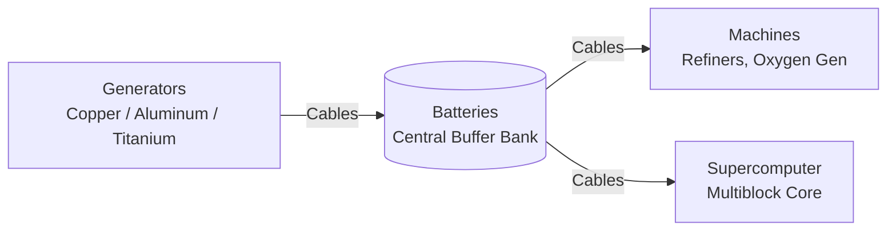

# ⚡ Energy Basics & Power Grid Guide

ShuDynamics features a streamlined **3-Tier Energy System** measured in **E (Energy / RF units)**. Power is generated, stored, transmitted, and consumed dynamically across your network.

---

## ⚡ Energy Tiers Overview

| Tier | Primary Metal | Generation Rate | Cable Max Transfer | Battery Storage | Primary Use Cases |
| :--- | :--- | :--- | :--- | :--- | :--- |
| **Tier 1 (Early)** | **Copper** | 40 E/t | 200 E/t | 100,000 E | Basic machines, Refiners, early battery banks |
| **Tier 2 (Mid)** | **Aluminum** | 120 E/t | 800 E/t | 500,000 E | Oxygen Generator, Compressors, Mid-game networks |
| **Tier 3 (Late)** | **Titanium** | 400 E/t | 3,200 E/t | 2,500,000 E | Supercomputer arrays, heavy manufacturing |

---

## 🔌 Building a Stable Power Grid

### 1. Generating Energy
* Generators burn fuel (such as Coal, Charcoal, or super-efficient **Enchanted Coal**).
* Higher tier generators extract energy much faster and boast significantly higher internal buffers.

### 2. Buffering with Batteries
* Machines can have spike power demands. Placing a **Battery** between your generators and machines prevents energy loss and keeps operations smooth when fuels run low.

### 3. Cable Connections & Auto-Push
* Cables connect automatically to adjacent machines and energy storage blocks.
* Energy cables have tier limits—make sure your cables match or exceed the output rate of your connected power generators to prevent bottlenecks.
